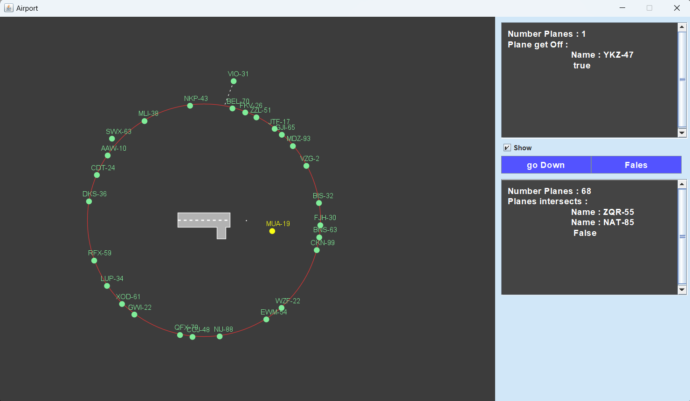

# Air-Traffic-Simulator
نظام محاكاة لحركة الطائرات على الرادار باستخدام Java وGraphics2D. يُتيح النظام التحكم في هبوط الطائرات ويعتمد على خوارزمية مسار مستقيم لتحريك الطائرة نحو المدرج. يتم تسجيل حالات الاصطدام بين الطائرات وعرضها في لوحة المراقبة، مع عرض الطائرات التي نجحت في الهبوط. النظام يوفّر للمستخدم تحكماً مباشراً من خلال لوحة تحكم لتنظيم هبوط الطائرات
## واجهة النظام

## لوحة التحكم

